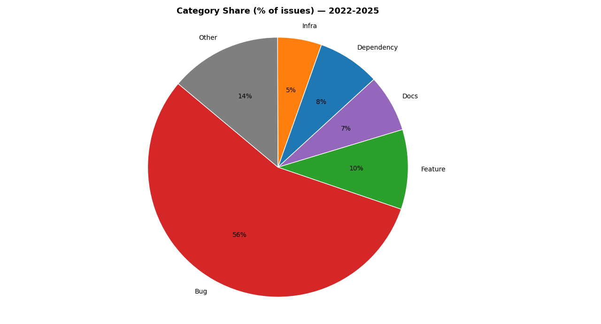
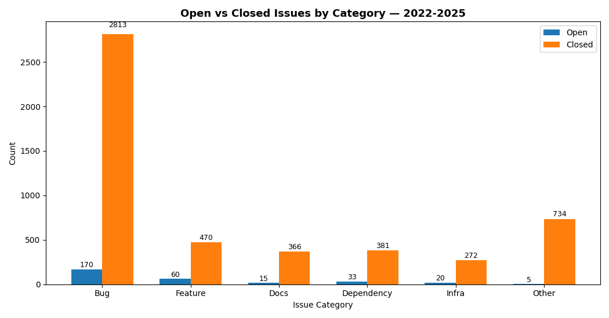
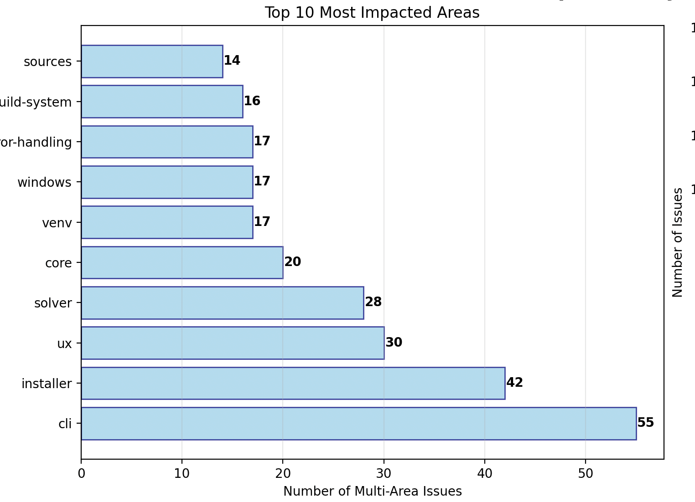
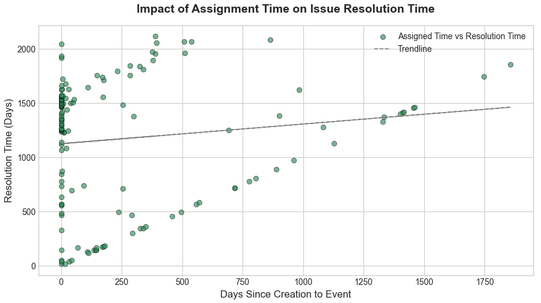
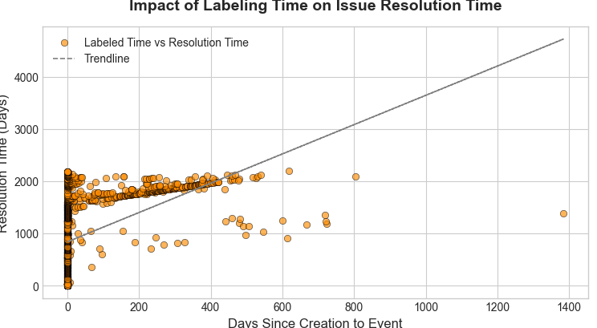

# ENPM611 Project Application Template

This project involves developing an application that analyzes GitHub issues from the Poetry open-source project to generate meaningful insights. The application retrieves data from a JSON file (poetry_issues.json) and performs detailed analyses to identify trends, highlight key contributors, and categorize issue types—providing a comprehensive view of the project’s ongoing activity and user engagement.

The application includes several core modules:

`data_loader.py` – A utility that loads issues from the provided data file and returns them in a structured runtime format (e.g., as Python objects).

`model.py` – Defines the data model into which the JSON file is loaded, allowing convenient access to issue attributes through object fields.

`config.py` – Handles configuration parameters for the application using the config.json file. Additional configuration options can be added as needed.

`run.py` – The main entry point for running the application. Based on the --feature command-line argument, it executes one of the implemented analyses. This module can be extended to integrate additional analytical features.

An example analysis is provided in `example_analysis.py`, which demonstrates how to use the utility modules and how to generate analytical outputs.

## Setup

To get started, your team should create a fork of this repository. Then, every team member should clone your repository to their local computer.

### Install dependencies

In the root directory of the application, create a virtual environment, activate that environment, and install the dependencies like so:

```
pip install -r requirements.txt
```

### Download and configure the data file

Download the data file (in `json` format) from the project assignment in Canvas and update the `config.json` with the path to the file. Note, you can also specify an environment variable by the same name as the config setting (`ENPM611_PROJECT_DATA_PATH`) to avoid committing your personal path to the repository.

### Run an analysis

With everything set up, you should be able to run the existing example analysis:

```
python run.py --feature 0
```

That will output basic information about the issues to the command line.

## Feature 1 – Most Active Categories Analyser

This feature quantifies project activity and highlights the most active GitHub issues within a chosen time window. It also summarizes the distribution of issue categories and the Open vs Closed mix per category, so maintainers can see where work concentrates and what’s blocking and concerned category.

What it measures

### Activity Score (per issue):

Sums normalized counts of events (e.g., opened, commented, labeled, closed, referenced). Normalization puts each event type on a 0–1 scale, then all event types are added for a single score. This rewards issues with high and diverse activity, not just one noisy signal like comments.

### Category Share (%):

A pie chart showing what % of issues belong to Bug, Feature, Docs, Dependency, Infra, Other in the selected period.

### Open vs Closed by Category:

A grouped bar chart showing how many issues are open vs closed for each category.

#### Typical insights

Top-N active issues surface hot spots for triage or follow-up.

Category share helps you see whether the backlog is dominated by, say, bugs vs features.

Open vs Closed mix pinpoints categories that are piling up (open) or getting resolved (closed).

A large “Other” bucket suggests label hygiene opportunities; the CLI will also print top raw labels found in “Other” to help refine your taxonomy.

### Run feature 1

```
python run.py --feature 1
```

#### Optional flags

```

--year 2024 or --start-year 2023 --end-year 2024

--top 10 – show top N most active issues

--type "Bug,Feature" – filter by high-level category

--labels "area/cli, kind/bug" – raw label substring filter (case-insensitive)
```

#### Example

```
python run.py --feature 1 --start-year 2022 --end-year 2025 --top 12
```

#### Sample outputs

### Figure 1 – Category Share (Pie)


Shows the percentage of issues in each category for the selected period. A skew toward Bug may indicate stability work; heavy Feature share may reflect roadmap push.

### Figure 2 – Open vs Closed by Category (Grouped Bars)



Compares counts of open vs closed issues per category. Categories with many open and few closed bars may require staffing or scope review.

### Figure 3 – Top-N Most Active Issues (Lollipop Plot)


Ranks issues by Activity Score. Each line represents one issue; longer lines indicate higher normalized activity (more events across more types). Use this to prioritize reviews, decisions, or fixes.

### CLI extras – “Other” label breakdown

When “Other” is large, the CLI prints the top raw labels and families (e.g.,` status/*`, `area/*`, `kind/*`) found in that bucket. Use this to refine your label mapping and shrink “Other”.

#### How the Activity Score is calculated (high level)

For each event type:

1. Count events per issue during the selected period.
2. Normalize that column to 0–1 across issues.
3. Sum all normalized event columns → Activity Score.

This balances different event types and highlights issues with broad engagement, not just a single spiky metric.

## Feature 2 – Multi-Area Impact Analyzer (R4 Analysis)

This feature identifies and analyzes GitHub issues that impact multiple areas of the application simultaneously. By examining issues with multiple "area/" labels, it helps maintainers understand which problems have the broadest scope and which areas of the codebase are most frequently involved in complex, cross-cutting issues.

### What it analyzes

**Multi-Area Issues**: Issues containing more than one label starting with "area/" (e.g., area/cli, area/core, area/docs).

**Impact Ranking**: Issues are ranked by the number of different areas they affect, with higher area counts indicating broader impact.

**Area Vulnerability**: Identifies which areas are most frequently involved in multi-area issues, highlighting potential architectural concerns or areas needing attention.

### Key insights

- **High-Impact Issues**: Surface issues that affect multiple components, requiring coordinated fixes across teams.
- **Architectural Hotspots**: Identify areas that frequently appear in multi-area issues, suggesting tight coupling or shared dependencies.
- **Cross-Team Coordination**: Help project managers understand which issues may require collaboration between multiple area owners.
- **Timeline Analysis**: Track how multi-area complexity evolves over time.

### Interactive Timeline Selection

The analyzer provides an interactive menu for selecting the analysis timeframe:

1. Last 3 months
2. Last 6 months
3. Last 12 months
4. Last 18 months
5. Last 24 months
6. All time

### Run feature 2

```
python3 run.py --feature 2
```

The analyzer will prompt you to select a timeline and then provide:

#### Standard Output Results:

- **Top 10 Highest Impact Issues**: Ranked by number of areas affected
- **Area Impact Ranking**: Which areas appear most frequently in multi-area issues
- **Summary Statistics**: Total areas affected, average areas per issue, maximum complexity
- **Most Impacted Area**: The area involved in the most multi-area issues

#### Visual Charts:

- **Top 10 Most Impacted Areas**: Bar chart showing which areas are most frequently involved
- **Distribution of Multi-Area Impact**: Histogram of how many areas issues typically affect
- **Issue State Distribution**: Pie chart showing open vs closed status of multi-area issues
- **Timeline Trend**: Line chart showing multi-area issue creation over time

#### Sample outputs

### Figure 1 – Top 10 Most Impacted Areas



Shows which areas of the codebase are most frequently involved in multi-area issues. This helps identify architectural hotspots and areas that may require attention or refactoring.

### Figure 2 – Issue State Distribution


Pie chart showing the proportion of open vs closed issues among those affecting multiple areas. This reveals whether multi-area issues are being resolved or accumulating.

### Example Usage

```bash
python run.py --feature 2
# Select option 3 (Last 12 months) when prompted
```

### Demo Mode

For testing or demonstration purposes, you can also run:

```bash
python demo_multi_area.py
```

This will automatically analyze multiple timeframes without interactive prompts.

### Typical Insights

- Issues affecting 3+ areas often indicate architectural decisions or major features requiring cross-team coordination
- Areas that frequently appear together in multi-area issues may have tight coupling that could benefit from refactoring
- A high volume of multi-area issues in recent months might suggest increasing system complexity
- Closed multi-area issues can provide examples of successful cross-team collaboration patterns

## Feature 3 - Top User Activity

This feature analyzes contributor engagement within the Poetry GitHub repository by measuring how active each user is in creating, closing, and commenting on issues.
The goal is to highlight the most active community members and visualize their contribution levels using a ranked bar chart.

Insights:

1. Helps identify the top contributors who are most engaged in project discussions and maintenance.
2. Provides visibility into user participation across multiple actions — opening, closing, and commenting on issues.
3. Enables maintainers to understand who drives activity within the repository and recognize community involvement.

### Run feature 3

```
python3 run.py --feature3
```

#### Sample output

### Figure - Top 5 Active Contributors


Showing top 5 contributors based on if user created, closed or commented on issues

## Feature 4 - Resolution Time Analyser

This feature analyzes how specific GitHub issue events such as labeling and assignment influence the overall resolution time of issues.
The goal is to identify patterns that reveal which early actions help close issues faster and which may introduce delays.

Insights:

1. A negative trendline slope indicates that earlier labeling or assignment correlates with faster resolution.
2. If the slope is flat or positive, it suggests that these events may not strongly influence closure speed.
3. This analysis helps maintainers prioritize when to apply labels or assign owners to improve triage efficiency.

### Run feature 4

```
python run.py --feature 4
```

#### Sample outputs:

### Figure 1 – Impact of Labeling Time on Issue



Each point represents an issue. The x-axis shows how many days after creation it was labeled, and the y-axis shows how long the issue took to resolve.
A negative slope in the trendline indicates that issues labeled earlier tend to close faster, suggesting that early triage improves efficiency.

### Figure 2 – Impact of Labeling Time on Issue



This plot compares the time to first assignment with total resolution time.
A visible downward trend suggests that assigning an issue to a developer sooner often correlates with shorter resolution durations, emphasizing the importance of prompt ownership.

## VSCode run configuration

To make the application easier to debug, runtime configurations are provided to run each of the analyses you are implementing. When you click on the run button in the left-hand side toolbar, you can select to run one of the three analyses or run the file you are currently viewing. That makes debugging a little easier. This run configuration is specified in the `.vscode/launch.json` if you want to modify it.

The `.vscode/settings.json` also customizes the VSCode user interface sligthly to make navigation and debugging easier. But that is a matter of preference and can be turned off by removing the appropriate settings.
